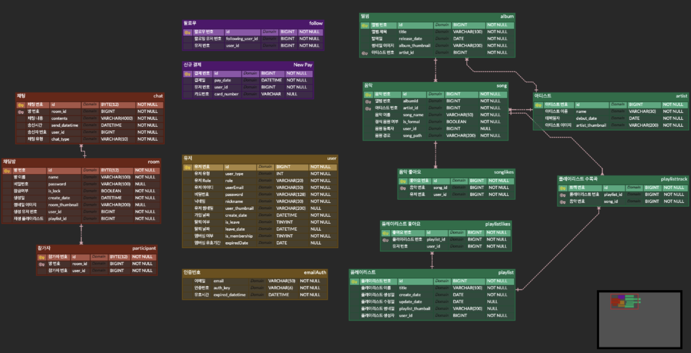

smingsming

# 기업연계 프로젝트  - 팀 스밍스밍

　  
## Description

> 스파로스 아카데미 1기 2차 기업연계 프로젝트

> 2022.09.13 ~ 2022.11.10

　  
## About Project
### ⚒ Front Languages & Platforms
</a>
</a>
</a>
</a>
 </a>

### ⚒ Back Languages & Platforms
</a>
</a>
</a>
</a>
 </a>

### ⚒ Tools
 </a>
 </a>

 </a>
 </a>
 </a>
 </a>
 </a>
　  

## System Spec

| * | Specification |
|:------:| :- |
| Platform | Next.js 12.0 |
| WAS | Spring Boot 2.6.8 |
| DB | Mysql DB    Redis    Mongo DB |
| 언어 | Java (JDK 11.0.15)  JavaScript |
| IDE | Intellij IDEA  Visual Studio Code |
| 형상관리 | GIT |

　  
## Distributing Roles
### 👨‍💻 Front-end
* 팀원 강동협: 퍼블리싱, UI/UX 총괄, 회원가입, 로그인, 홈피드, 마이페이지, 플레이리스트, 좋아요
* 팀원 최진석: API 연결 관리, User, 마이페이지, 음원, 채팅, 검색, 예외처리

### 👨‍💻 Back-end
* 팀장 정혜윤 : CI/CD, User, 시큐리티, 플레이리스트, 팔로우, 좋아요 기능 구현
* 팀원 민광식 : API 연결, 검색, 음원, 채팅 기능 구현
　  
## [ER diagram](https://www.erdcloud.com/d/Kiuv6hsaktt5AhegW)

## [화면설계서](https://www.figma.com/file/8QKxDA9X93SblC2HkBSAUG/Sming-Sming?node-id=0%3A1)

## [화면정의서](https://docs.google.com/presentation/d/1pd8nV2ZLs4-HWw1dbYU9lgc0gnLSC452/edit)

## [Requirements Specification](https://docs.google.com/spreadsheets/d/1h0bwG5rpz2PIL-nzUS_wUebae_34hMkCdxuDkRUPh8c/edit?usp=sharing)

## [API definition](https://docs.google.com/spreadsheets/d/12nOguE9l1JOKt8SKRY-HHSe4u4cLdYqLRlauNgJj_Zs/edit?usp=sharing)

　  
## [구현 영상](https://www.youtube.com/watch?v=bXAIobVNImg)
